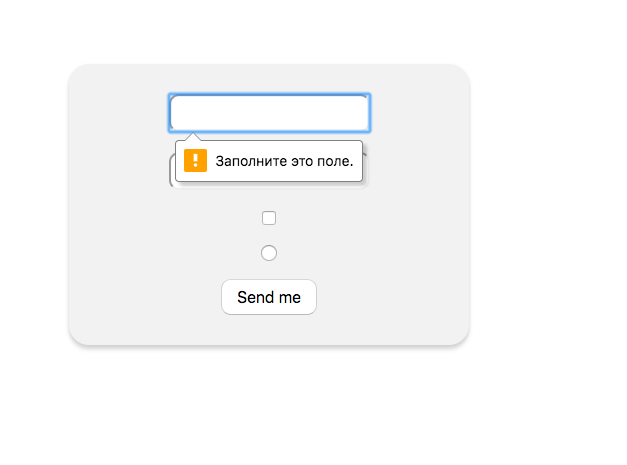
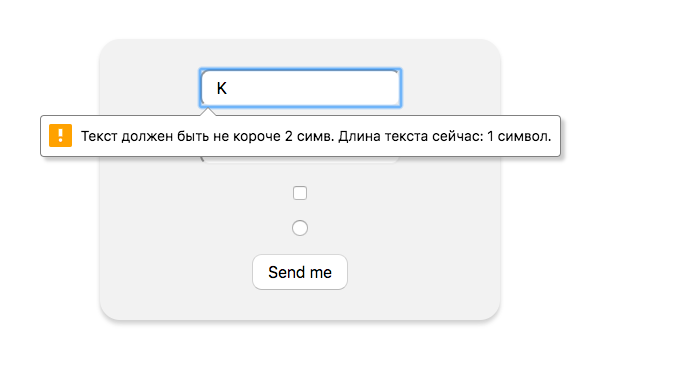
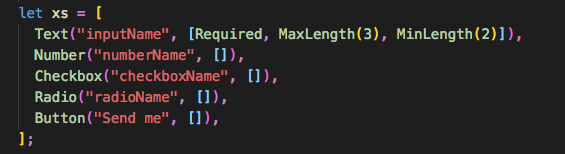

# ReasonReact form

## Пояснение

Валидность формы происходит с помощью HTML5 атрибутов, таких как required, maxlength и т.д.



Элементы и валидация формы добавляются в переменную xs



## Run Project

```sh
npm install
npm start
# in another tab
npm run webpack
```

After you see the webpack compilation succeed (the `npm run webpack` step), open up `src/index.html` (**no server needed!**). Then modify whichever `.re` file in `src` and refresh the page to see the changes.


## Build for Production

```sh
npm run build
npm run webpack:production
```

This will replace the development artifact `build/Index.js` for an optimized version.

